# Day 2 코드 따라가기

처음 실행할 때는 결과만 보지 말고, 터미널에 찍힌 `code path`를 따라가면서 파일을 같이 열어보세요.

```bash
python3 day2_aicc/app.py --scenario order_status
```

이 명령은 “주문 상태를 알려줘”라는 조회 요청 하나를 LangGraph에 넣어요. 결과가 왜 그렇게 나오는지는 아래 순서로 확인하면 돼요.

---

## LangGraph부터 짧게 잡기

Day 1의 ReAct loop는 `while` 안에서 생각하고 tool을 부르는 구조였어요. Day 2에서는 그 loop를 고객응대 서비스 단계로 쪼개요.

```text
StateGraph(AICCState)
  ├─ node: input_guard
  ├─ node: triage
  ├─ node: load_context
  ├─ node: retrieve_policy
  ├─ node: context_guard
  ├─ node: specialist
  ├─ node: action_guard
  ├─ node: execute_action
  └─ node: final_review
```

LangGraph에서 꼭 볼 개념은 네 가지예요.

| 개념 | 이 실습에서 보는 위치 | 의미 |
|---|---|---|
| State | `state.py::AICCState` | node들이 공유하는 상담 상태 |
| Node | `nodes/*.py::*_node()` | 상태를 읽고 일부 필드만 업데이트하는 함수 |
| Edge | `graph.py::build_graph()` | 다음 node로 넘어가는 순서 |
| Checkpoint | `graph.py::open_compiled_graph()` | `thread_id` 기준으로 중간 상태 저장/재개 |

### 노드가 전부 agent는 아니에요

`triage`라는 이름 때문에 agent처럼 느껴질 수 있지만, 이 실습에서는 router에 가까워요. 문자열 기반으로 intent와 주문번호를 잡고 다음 node로 넘겨요. LLM agent 역할은 `specialist` 하나에만 있어요.



Mermaid 원본: [`aicc_structure.mmd`](./diagrams/aicc_structure.mmd)

node 함수는 보통 이런 모양이에요.

```python
def triage_node(state: AICCState) -> dict[str, Any]:
    ...
    return {"intent": intent, "order_id": order_id}
```

반환값 전체가 새 state가 되는 게 아니라, 기존 state에 덮어쓸 “patch”라고 보면 돼요.

---

## 첫 실행 결과 해부

`order_status` 실행 결과에서 나오는 필드를 코드와 연결해 봐요.

| 출력 필드 | 어디서 만들어지는지 | 해석 |
|---|---|---|
| `thread_id` | `app.py::make_initial_state()` | checkpoint에서 상담 세션을 찾는 키 |
| `scenario` | `scenarios.py::SCENARIOS` | 실습용 입력 fixture 이름 |
| `intent/order` | `nodes/routing.py::triage_node()` | 요청 분류와 메시지에서 뽑은 주문번호 |
| `model/guards` | `app.py::make_initial_state()`, `model_policy.py` | 사용할 모델 정책과 guardrail 설정 |
| `blocked` | `guardrails.py::block()` | 어느 layer에서 멈췄는지 |
| `actions` | `nodes/actions.py::execute_action_node()` | 실제로 실행된 쓰기 tool 목록 |
| `cost estimate` | `model_policy.py::estimate_cost()` | prompt caching을 반영한 추정 비용 |
| `answer` | `nodes/actions.py::final_review_node()` | 고객에게 보여줄 최종 문장 |
| `risk events` | 각 node의 `append_risk_event()` / `append_event()` | graph가 지나온 흔적 |
| `code path` | `app.py::code_path_lines()` | 다음에 열어볼 파일 순서 |

`order_status`에서 `actions`가 `(none)`으로 나오는 이유:

1. `scenarios.py`의 메시지는 “주문 상태와 결제 여부 알려줘”예요.
2. `triage_node()`가 `order_status` intent로 분류해요.
3. `load_context_node()`가 주문/고객/배송 데이터를 읽기 tool로 가져와요.
4. `specialist`는 답변 초안만 만들고 `proposed_actions`를 비워둬요.
5. `action_guard_node()`는 실행할 action이 없어서 `action_guard:no_action`을 남겨요.
6. `final_review_node()`가 답변과 비용 추정을 붙여요.

---

## 파일별로 읽는 순서

처음부터 모든 파일을 다 볼 필요는 없어요. 아래 순서로 보면 흐름이 덜 끊겨요.

### 1. 입력이 state로 바뀌는 곳

```bash
sed -n '1,120p' day2_aicc/scenarios.py
sed -n '1,115p' day2_aicc/app.py
sed -n '1,110p' day2_aicc/state.py
```

확인할 것:

- `SCENARIOS['order_status']`의 `message`, `user_id`
- `make_initial_state()`가 `message`, `model_policy`, `guard_mode`, `attack_mode`를 넣는 방식
- `AICCState`에 입력, context, action, output 필드가 같이 있는 이유

### 2. LangGraph wiring

```bash
sed -n '1,120p' day2_aicc/graph.py
```

확인할 것:

- `builder.add_node(...)`에 등록된 이름
- `builder.add_edge(...)`의 순서
- `input_guard`, `load_context`, `action_guard` 뒤에 있는 conditional edge
- `blocked`면 바로 `final_review`로 가는 구조

### 3. 조회형 요청 흐름

```bash
sed -n '1,130p' day2_aicc/nodes/routing.py
sed -n '1,130p' day2_aicc/nodes/context.py
sed -n '1,90p' day2_aicc/tools.py
```

확인할 것:

- `parse_intent()`가 `order_status`를 고르는 조건
- `load_context_node()`가 `get_order`, `get_customer`, `get_shipment`을 호출하는 순서
- `nodes/specialist.py::mock_specialist_node()`나 `live_llm.py::live_specialist_node()`가 `answer_draft`와 `proposed_actions`를 만드는 위치

### 4. 쓰기 action 흐름

```bash
python3 day2_aicc/app.py --scenario address_change_processing --llm-mode mock
sed -n '1,190p' day2_aicc/nodes/specialist.py
sed -n '120,180p' day2_aicc/guardrails.py
sed -n '90,150p' day2_aicc/tools.py
```

확인할 것:

- `specialist`가 `update_shipping_address`를 `proposed_actions`에 넣는 위치
- `validate_action()`이 `processing` 상태인지 확인하는 위치
- `execute_action_node()`가 `TOOL_REGISTRY`에서 실제 함수를 찾아 실행하는 위치

---

## Checkpoint / resume 흐름

`thread_id`는 상담 세션 키처럼 쓰여요. `--interrupt-after retrieve_policy`로 멈추면 SQLite checkpoint에 마지막 state와 다음 node가 남고, `--resume`은 그 다음 node부터 이어서 실행해요. 그림은 위 구조도 하나만 보고, checkpoint는 명령어 출력의 `paused before ...`와 `resume command`만 확인해요.

---

## Prompt injection 흐름 보기

### Direct injection

```bash
python3 day2_aicc/app.py --scenario direct_injection --llm-mode mock
sed -n '1,85p' day2_aicc/guardrails.py
```

흐름:

```text
사용자 메시지에 공격 문구 포함
  -> input_guard_node()
  -> DIRECT_INJECTION_PATTERNS 매칭
  -> blocked=True
  -> final_review_node()
```

여기서는 모델까지 가지 않는 게 포인트예요. 사용자 입력 자체가 공격이라 가장 앞단에서 끊어요.

### Indirect injection

```bash
python3 day2_aicc/app.py --scenario indirect_policy --policy cheap --guards off --llm-mode mock
python3 day2_aicc/app.py --scenario indirect_policy --policy cheap --guards context,action --llm-mode mock
sed -n '110,165p' day2_aicc/mock_data.py
sed -n '1,120p' day2_aicc/nodes/context.py
sed -n '74,118p' day2_aicc/guardrails.py
```

흐름:

```text
외부 FAQ/CMS 문서에 payload 숨어 있음
  -> retrieve_policy_node()가 문서를 가져옴
  -> context_guard가 없으면 specialist가 instruction처럼 볼 수 있음
  -> cheap profile은 issue_coupon 50000원을 제안할 수 있음
  -> action_guard가 없으면 tool 실행까지 이어짐
```

여기서는 “사용자가 공격 문구를 직접 말하지 않아도” 문제가 생기는 걸 봐요. 그래서 input guard만으로는 부족하고, context guard와 action guard를 같이 봐야 해요.

---

## 모델 비용과 prompt caching 보기

```bash
python3 day2_aicc/eval_day2.py --compare-models --llm-mode mock
cat .eval/day2_eval_latest.md
sed -n '1,135p' day2_aicc/model_policy.py
```

`estimate_cost()`에서 나눠 보는 값:

| 값 | 의미 |
|---|---|
| `stable_prompt_tokens` | system prompt + tool schema처럼 매번 반복되는 부분 |
| `cached_input_tokens` | prompt caching 후보 |
| `request_tokens` | 고객 메시지, 주문, 배송, 정책 문서처럼 매 요청마다 바뀌는 부분 |
| `batch_multiplier` | 오프라인 eval처럼 즉시 응답이 필요 없는 작업의 할인 비교값 |

여기서 숫자는 실제 과금 청구서가 아니라 “설계 선택 비교용 추정치”예요. 같은 요청을 `cheap`, `standard`, `strong`으로 바꿨을 때 품질과 비용이 어떻게 움직이는지 보는 용도예요.

---

## TODO를 고를 때 보는 위치

| 하고 싶은 수정 | 먼저 열 파일 | 같이 볼 파일 |
|---|---|---|
| intent 추가 | `nodes/routing.py::parse_intent()` | `state.py::IntentName`, `eval_day2.py::EVAL_CASES` |
| 배송지 변경 조건 강화 | `guardrails.py::validate_action()` | `mock_data.py::SHIPMENTS` |
| 모델 라우팅 변경 | `model_policy.py::route_model_for_intent()` | `eval_day2.py` 리포트 |
| direct injection 패턴 추가 | `guardrails.py::DIRECT_INJECTION_PATTERNS` | `scenarios.py` |
| indirect payload 패턴 추가 | `guardrails.py::INDIRECT_INJECTION_PATTERNS` | `mock_data.py::POISONED_POLICY_DOC` |
| 새 평가 케이스 추가 | `eval_day2.py::EVAL_CASES` | `scenarios.py::SCENARIOS` |

수정 후에는 최소한 이 두 개를 다시 실행해요.

```bash
python3 day2_aicc/app.py --scenario order_status --llm-mode mock
python3 day2_aicc/eval_day2.py --compare-models --llm-mode mock
```
